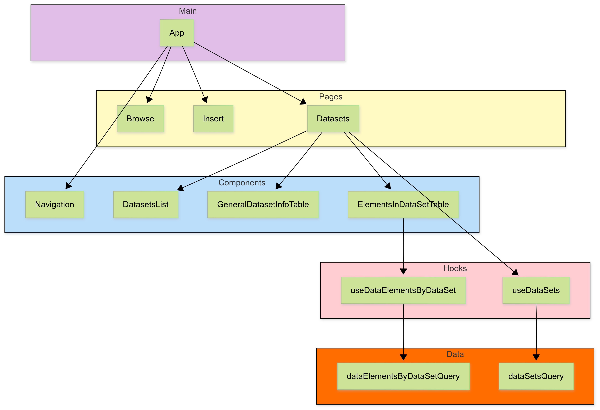

# README IN5320 Oblig 3

## Oppgavebeskrivelse

Denne oppgaven er en DHIS2-applikasjon som henter datasett og metadata fra DHIS2-API-et og er en videreføring av DHIS2-oppgavene knyttet til IN5320 sitt nettkurs om DHIS2-plattformen.  
Den mest relevante delen av koden i denne oppgaven er knyttet til **Datasets-taben** som henter datasettene i API-et, og viser disse i en liste.  

Når brukeren velger et datasett i margmenyen på venstre side, vises datasettes detaljer i en tabell med `id`, `displayName` og `created`.  

Oppgaven er utvidet slik at også "step 6" og "step 7" er implementert. Dette betyr at når brukeren velger et datasett, så vises ikke bare den generelle informasjonen om datasettet i sidens hovedinnholdsområde, men også metadataene som datasettet består av. Se bilde under:


## Modularisering av koden

Filstrukturen i koden er modularisert på denne måten

```Bash
src
├── components/
├── data/
├── hooks/
├── locales/
├── pages/
├── styles/
└── App.jsx
```


## Arkitektur


